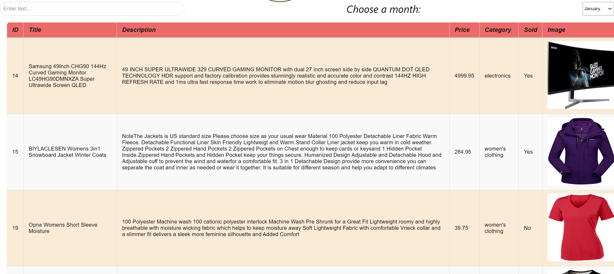
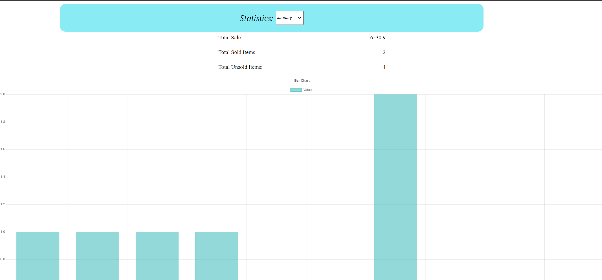

# MERN-Assignment
## ⭐ Introduction 

This is a project which is built using MERN stack🚀


## Screenshots
Home Page


Tracker Page



## API Reference

#### Get all items based on search query and specified month

```http
  GET http://localhost:9000/transaction/gettransactions?searchTerm=${searchTerm}&page=${pageNumber}&month=${selectedMonth}
```

#### Get Statistics

```http
  GET http://localhost:9000/transaction/getStatistics?month=${Month}
```

#### Get Bar Graph stats

```http
  GET http://localhost:9000/transaction/getBarGraphStats?month=${selectedMonth}
```

#### Get Bar Graph stats

```http
  GET http://localhost:9000/transaction/getBarGraphStats?month=${selectedMonth}
```

#### Get pie chart stats

```http
  GET http://localhost:9000/transaction/getPieChartStats?month=${selectedMonth}
```


#### Get all types of stats

```http
  GET http://localhost:9000/transaction/getAllTypeStats?month=${selectedMonth}
```


